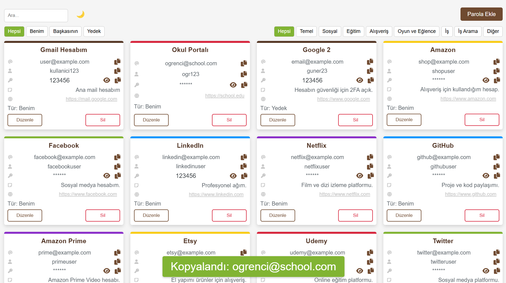
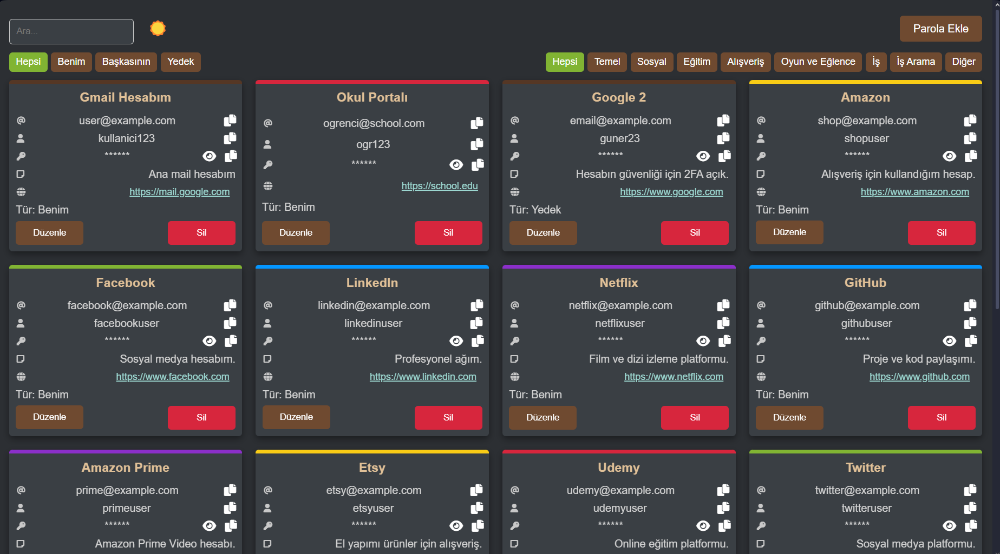
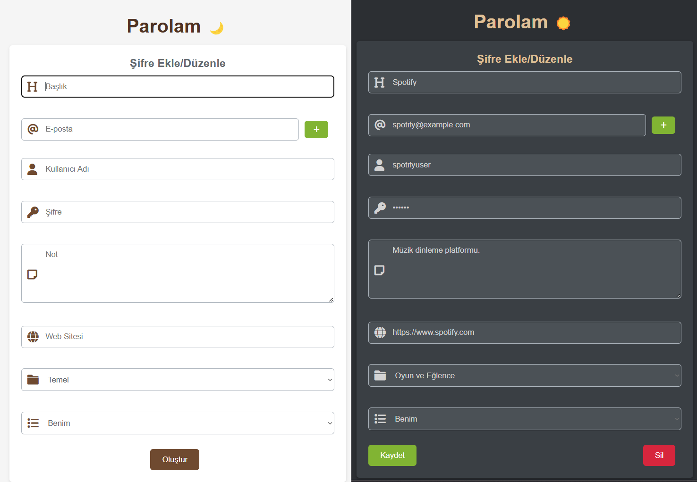

# Parolam - Basit Şifre Yöneticisi

Bu proje, kişisel hesaplarımı ve şifrelerimi yerel bir web sayfasında düzenli ve hoş bir tasarımla saklamak için geliştirdiğim basit bir şifre yöneticisidir. Bir günde, yapay zekadan da yardım alarak tamamladım ve tamamen açık kaynak olarak paylaşıyorum. İhtiyacı olan herkes bu projeyi indirip kendi ihtiyaçlarına göre kullanabilir veya geliştirebilir!

## Özellikler
- **Yerel Depolama:** Şifreler yalnızca yerel `data.js` dosyasında saklanır, böylece güvenlik tamamen sizin kontrolünüzde kalır.
- **Basit Teknoloji:** HTML, CSS ve JavaScript kullanılarak geliştirildi; ek bağımlılık yok.
- **Kullanıcı Dostu Tasarım:** Kategorilere göre renklendirilmiş kartlar, dark mode/light mode desteği ve FontAwesome ikonları ile modern bir arayüz.
- **Dinamik Veri Güncelleme:** Şifre eklediğinizde, düzenlediğinizde veya sildiğinizde "Güncel Veriyi İndir" butonu ile `data.js` dosyasını güncelleyebilirsiniz.
- **Şifreleme:** Şifreler AES algoritması ile yerel olarak şifrelenir.

## Neden Bu Yaklaşım?
Web tarayıcılarının güvenlik politikaları nedeniyle, bir web sayfası üzerinden yerel dosyalarda doğrudan değişiklik yapılamıyor. Bu yüzden, uygulama içinde yapılan değişiklikler `localStorage`da tutuluyor ve güncellenmiş veriyi `data.js` olarak indirmeniz gerekiyor. İndirdiğiniz dosyayı projenizdeki eski `data.js` ile değiştirerek şifrelerinizi güncel tutabilirsiniz. Daha basit bir öneriniz varsa, lütfen paylaşın!

## Kurulum
1. Bu depoyu klonlayın veya ZIP olarak indirin:

    ```bash
      git clone https://github.com/Guner27/Parolam.git
    ```
2. `index.html` dosyasını bir web tarayıcısında açın.
3. Şifrelerinizi eklemeye başlayın!

## Kullanım
- Yeni bir şifre eklemek için `create.html` sayfasını kullanın.
- Şifreleri görüntülemek, düzenlemek veya silmek için `index.html` sayfasını kullanın.
- Değişiklik yaptığınızda "Güncel Veriyi İndir" butonuna tıklayın ve indirilen `data.js` dosyasını proje klasörünüzdeki eski dosyanın yerine koyun.

## Notlar
- **Dil Desteği:** Hızlı bir proje olduğu ve kişisel kullanım için tasarlandığı için yalnızca Türkçe destekliyor. İsterseniz projeyi indirip kendi dilinize uyarlayabilir veya çoklu dil desteği ekleyebilirsiniz.
- **Lisans:** Kişisel kullanım için ücretsizdir. Ticari amaçla kullanmamanızı rica ederim.

## Katkıda Bulunma
Fikirlerinizi, hata raporlarınızı veya geliştirmelerinizi bekliyorum! Pull request göndermekten çekinmeyin.

## İletişim
Sorularınız veya önerileriniz için LinkedIn üzerinden bana ulaşabilirsiniz: [LinkedIn Profilim](https://www.linkedin.com/in/muhammed-güner-aab456181/)

## Ekran görüntüleri








---

# Parolam - Simple Password Manager

This project is a simple password manager I developed to store my personal accounts and passwords locally in a well-designed web page. I completed it in one day with some help from AI and am sharing it as an open-source project. Anyone who needs it can download, use, or customize it to suit their needs!

## Features
- **Local Storage:** Passwords are stored only in a local `data.js` file, keeping security entirely in your hands.
- **Simple Tech Stack:** Built with HTML, CSS, and JavaScript—no additional dependencies.
- **User-Friendly Design:** Modern interface with category-colored cards, dark/light mode support, and FontAwesome icons.
- **Dynamic Data Updates:** Add, edit, or delete passwords, then use the "Download Updated Data" button to refresh the `data.js` file.
- **Encryption:** Passwords are encrypted locally using the AES algorithm.

## Why This Approach?
Due to web browser security policies, direct modifications to local files from a webpage are restricted. Therefore, changes made in the app are stored in `localStorage`, and you need to download the updated `data.js` file. Replace the old `data.js` in your project folder with the downloaded one to keep your passwords up to date. If you know a simpler method, please share!

## Installation
1. Clone this repository or download it as a ZIP:
   ```bash
    git clone https://github.com/Guner27/Parolam.git
   ```
3. Open `index.html` in a web browser.
4. Start adding your passwords!

## Usage
- Use `create.html` to add a new password.
- View, edit, or delete passwords using `index.html`.
- When you make changes, click "Download Updated Data" and replace the old `data.js` file in your project folder with the downloaded one.

## Notes
- **Language Support:** Designed for personal use and developed quickly, it only supports Turkish. Feel free to download and adapt it to your language or add multi-language support.
- **License:** Free for personal use. I’d appreciate it if you don’t use it for commercial purposes.

## Contributing
I’d love to hear your ideas, bug reports, or improvements! Feel free to submit a pull request.

## Contact
For questions or suggestions, reach out to me on LinkedIn: [My LinkedIn Profile](https://www.linkedin.com/in/muhammed-güner-aab456181/)

## Screenshots


